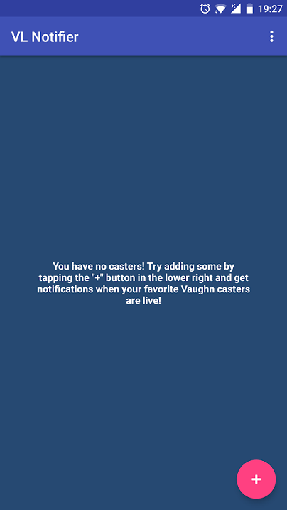
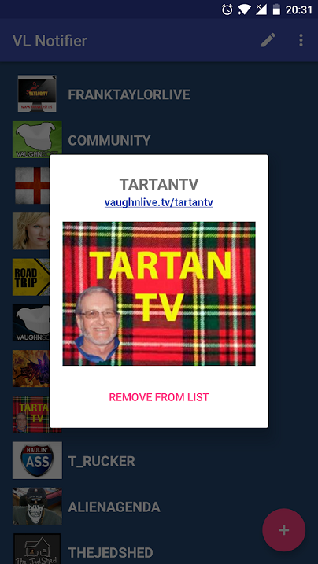
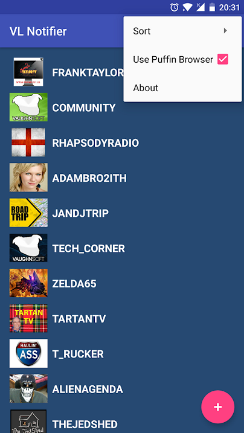
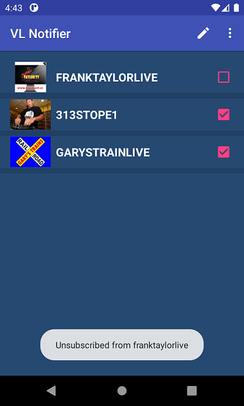

## VLNotifier

An Android app to let you follow and subscribe to certain streamers on the VL livestream platform, sending a notification to your device whenever one of the streamers you follow starts casting. [Relies on a separate server-based service](https://github.com/dandy-step/VLNotifier-server), which pulls the current status of the subscribed streamers and broadcasts a message to the app using Firebase Cloud Messaging.

Includes full client-based logic for subscribing on the app, editing your subscriptions, and removing certain streamers from your list. Also features Puffin Web Browser detection and integration, as the app was built prior to HTML5 video support on the site.

